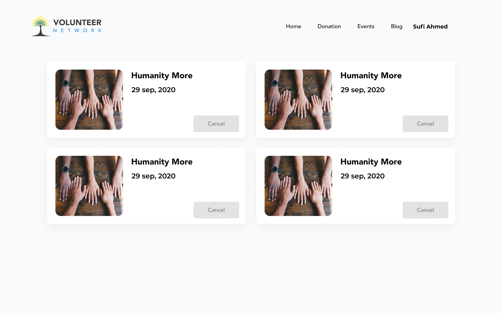
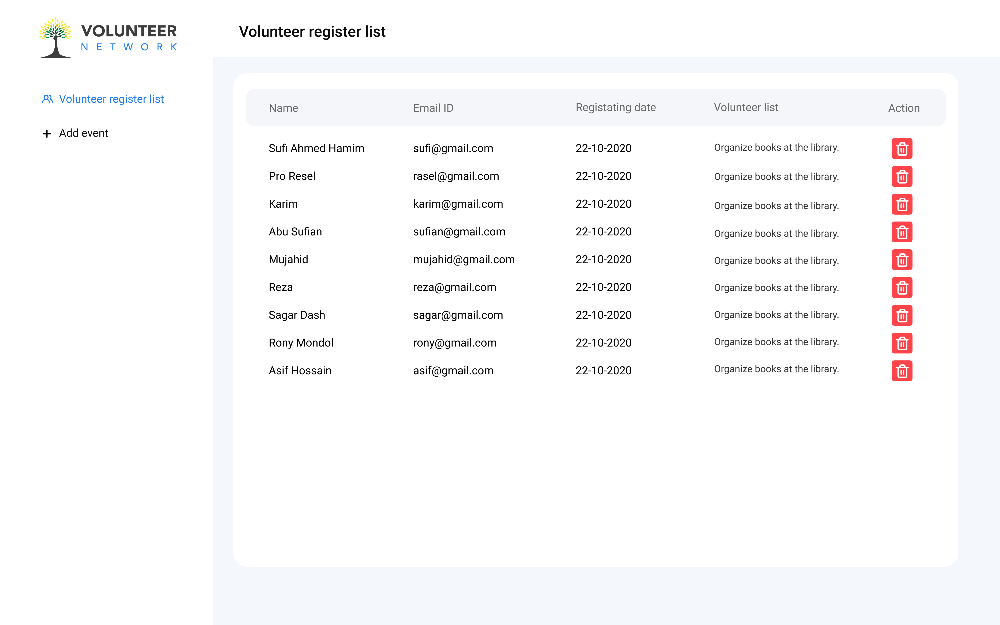

# Volunteer Network
# Overview
SPA for users to find volunteer services and do volunteer work.

## Live Site Link
[https://volunteer-network-ccb28.web.app/](https://volunteer-network-ccb28.web.app/)

# Features
- Users can see volunteer works.
- Users can register volunteer network.
- Users can manage their volunteer work.
- Admins can add new volunteer event.
- Admin can manage volunteer events registration.
- Dashboard for admins.
  
# Dependency
Used node pacakges
1. firebase
2. date-fns
3. jwt-decode
4. react
5. react-alert
6. react-bootstrap
7. react-multi-carousel
8. react-spring
9. react-datepicker
# Technology Used
1. React JavaScript
2. MongoDB
3. HTML5
4. CSS3
5. Firebase
6. Bootstrap
# Screenshots

# Resume Link
[https://drive.google.com/file/d/1ujv7trChovIPBPuZUj2Blh52QEScZs2L/view?usp=sharing](https://drive.google.com/file/d/1ujv7trChovIPBPuZUj2Blh52QEScZs2L/view?usp=sharing)

## How To Run
- Install the dependencies by running `npm install`
- In the project directory, you can run:

### `yarn start`

Runs the app in the development mode. 
Open [http://localhost:3000](http://localhost:3000) to view it in the browser.

The page will reload if you make edits. 
You will also see any lint errors in the console.

### `yarn build`

Builds the app for production to the `build` folder. 
It correctly bundles React in production mode and optimizes the build for the best performance.

The build is minified and the filenames include the hashes. 
Your app is ready to be deployed!

See the section about [deployment](https://facebook.github.io/create-react-app/docs/deployment) for more information.

### Deployment

This section has moved here: https://facebook.github.io/create-react-app/docs/deployment

